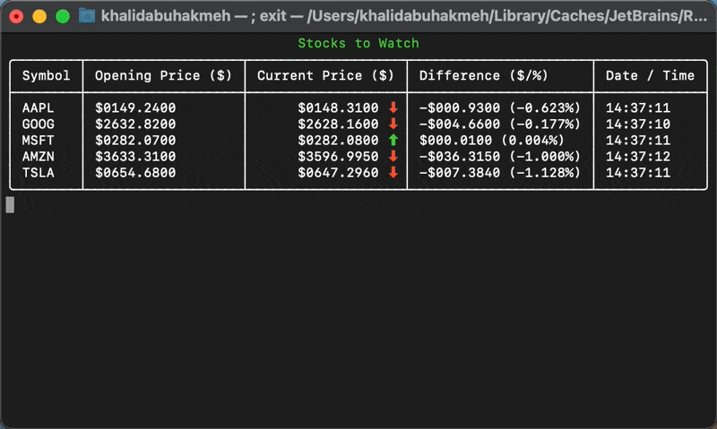

# Stonks Watcher

This sample console application uses `WebSocketClient` to stream
stock information to the console window in real-time!



To get started, you'll need a FREE account at https://finnhub.io and the
latest .NET SDK at https://dot.net. This project targets .NET 5. You can modify the settings in `appSettings.json` to add the `apikey` and stocks
you'd like to watch.

Once cloned, run the following from a command line to run the app.

``` console
> dotnet restore
> dotnet run
```

After that, you're off to the moon. 🚀💎🙌

Feel free to leave a star and follow me on Twitter: [@buhakmeh](https://twitter.com/buhakmeh).